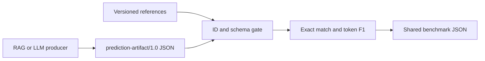

# #2 llm-eval-harness

**Claim:** Artifact-driven local evaluator for RAG/LLM answers with exact match, token F1, producer identity, and strict case-ID validation.

**Benchmark:** token F1 = `0.8449` and exact match = `0.25` across four versioned predictions produced by the `rag-knowledge-base` fixture. Evidence: `benchmarks/results/llm-eval-baseline.json`.

## What It Proves

The harness evaluates output from another repository without importing its code. A producer writes `prediction-artifact/1.0` JSON; this project validates schema version, producer identity, duplicate IDs, missing cases, and unexpected cases before calculating EM and token F1.

The committed predictions are deterministic fixtures shaped exactly like a RAG export. Their quality score proves the evaluator and integration boundary, not the quality of a live LLM.

## Architecture



The contract boundary is `contracts/prediction-artifact.schema.json`. Producers may implement any stack as long as they emit that file shape.

## Run Locally

```powershell
$env:PYTHONPATH = "src"
python -m llm_eval_harness benchmark --references data/fixtures/references.jsonl --predictions data/fixtures/rag-predictions.v1.json --output benchmarks/results/llm-eval-baseline.json
```

To evaluate a new RAG run, keep the reference IDs stable and replace only `--predictions` with the exported artifact path.

## Run With Docker

```powershell
docker build -t llm-eval-harness .
docker run --rm llm-eval-harness
```

## Result Contract

The result includes the shared fields `project`, `metric`, `value`, `unit`, `timestamp`, `command`, `samples`, and `environment`. Producer latency from the artifact is reported separately from evaluator overhead.

## Failure Semantics

- Duplicate reference or prediction IDs fail.
- Missing prediction IDs fail.
- Prediction IDs absent from the reference set fail.
- Unknown artifact schema versions fail.
- Metrics are never computed for a partial or ambiguous join.
