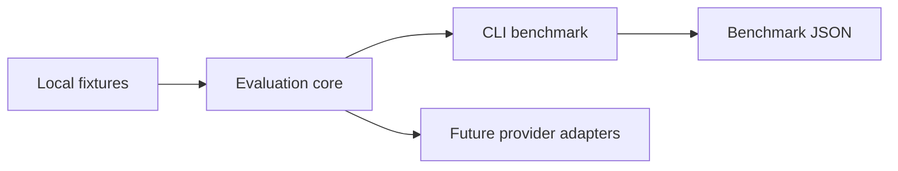

# #2 llm-eval-harness

**Claim:** Local-first evaluation harness for LLM/RAG answers with exact match, token F1, and reproducible latency benchmark.

**Benchmark:** `f1` = `0.8449` on local deterministic fixtures. Result file: `benchmarks/results/llm-eval-baseline.json`.

## What It Proves

This repository is part of **AI Evaluation and Retrieval Systems**. It provides one measurable layer of the AI Evaluation & RAG Platform while keeping the default path local-first, Dockerized, and free of paid credentials.

## Architecture



Dependency rule: evaluation core does not import provider SDKs, cloud SDKs, web frameworks, or GitHub automation.

## Run Locally

```powershell
$env:PYTHONPATH = "src"
python -m llm_eval_harness benchmark --output benchmarks/results/llm-eval-baseline.json
```

## Run With Docker

```powershell
docker build -t llm-eval-harness .
docker run --rm llm-eval-harness
```

## Benchmark Result

See `benchmarks/results/llm-eval-baseline.json`.

## Reuse Contract

- Uses `portfolio-reuse-kit` for agent graph, SDD, validation, design system, and publication gate.
- Records reusable improvement decisions in `sdd/reuse-improvement-review.md`.
- Runs without paid secrets by default.
