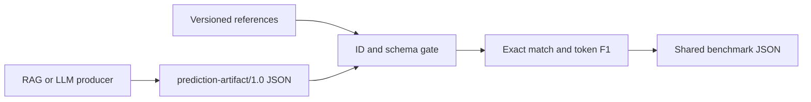

# LLM Evaluation Harness: Contract-First Scoring for RAG and LLM Outputs

**Token F1 `0.5718`** (exact match `0.00`) on predictions exported by a pinned [rag-knowledge-base](https://github.com/Brilhante29/rag-knowledge-base) commit, scored without importing a single line of producer code. The harness refuses to compute metrics when the join between predictions and references is ambiguous.

[](https://github.com/Brilhante29/llm-eval-harness/actions/workflows/validate.yml)
[](LICENSE)


## Why this exists

LLM evaluation usually fails quietly, not loudly. A prediction file is missing three cases and the average looks better; two cases share an ID and one silently wins; the evaluator imports the producer's code and ends up testing itself. This harness treats evaluation as an integration contract:

- producers emit a versioned `prediction-artifact/1.0` JSON file, validated against [`contracts/prediction-artifact.schema.json`](contracts/prediction-artifact.schema.json);
- duplicate IDs, missing cases, unexpected cases, and unknown schema versions fail the run, so no metric is ever computed on a partial join;
- the producer is pinned by commit in [`contracts/producers.lock.json`](contracts/producers.lock.json), and CI checks out that exact commit, exports a fresh artifact, and evaluates it;
- producer latency is reported separately from evaluator overhead.

## Results

| Metric | Value |
|---|---:|
| Token F1 | `0.5718` |
| Exact match | `0.00` |
| Predictions | 4 |

Why exact match is zero: the producer is a retrieval system, so each prediction is the top retrieved passage rather than a generated answer. Token F1 captures the partial overlap that EM cannot. The number validates the evaluator and the producer-consumer boundary; it is not a measurement of a live LLM.

## Quickstart

```bash
docker build -t llm-eval-harness .
docker run --rm llm-eval-harness
```

Local run:

```bash
export PYTHONPATH=src
python -m llm_eval_harness benchmark \
  --references data/fixtures/references.jsonl \
  --predictions data/fixtures/rag-predictions.v1.json \
  --output benchmarks/results/llm-eval-baseline.json
```

To evaluate a new run, keep the reference IDs stable and point `--predictions` at the exported artifact.

## How it works


```mermaid
flowchart LR
  RAG["RAG or LLM producer"] --> Artifact["prediction-artifact/1.0 JSON"]
  References["Versioned references"] --> Gate["ID and schema gate"]
  Artifact --> Gate
  Gate --> Metrics["Exact match and token F1"]
  Metrics --> Result["Shared benchmark JSON"]
```

| Module | Responsibility |
|---|---|
| `artifacts.py` | Artifact loading, schema version, and producer identity checks |
| `evaluator.py` | Strict ID join and per-case scoring |
| `metrics.py` | Normalization, exact match, token F1 |
| `cli.py` | `benchmark` command and result contract |

## Design decisions

| Decision | Why | Rejected |
|---|---|---|
| File contract between producer and evaluator | Any stack can produce predictions; nothing is imported | Evaluating by calling producer code in-process |
| Fail closed on join problems | A partial join produces a misleading average | Skipping unmatched cases |
| Producer lock as reviewed data | Upgrading the producer is an explicit, CI-verified change | Floating "latest" producer |
| Deterministic lexical metrics first | Reproducible and free | LLM-as-judge without a calibration set |

## Limitations

- Four predictions: enough to exercise every failure path, far too few to rank systems.
- Lexical metrics only; semantic similarity and faithfulness scoring are future work.
- The current producer retrieves, it does not generate.

## Reproducibility

- Publication evidence: [`benchmarks/publication/llm-eval-baseline-v2.json`](benchmarks/publication/llm-eval-baseline-v2.json).
- Raw execution: [`benchmarks/results/llm-eval-baseline.json`](benchmarks/results/llm-eval-baseline.json).
- Results share the portfolio fields `project`, `metric`, `value`, `unit`, `timestamp`, `command`, `samples`, and `environment`.

## Project structure

```text
src/llm_eval_harness/   artifacts, evaluator, metrics, CLI
tests/                  metric and failure-semantics tests
contracts/              prediction artifact schema and producer lock
data/fixtures/          references and a pinned producer snapshot
benchmarks/             raw results and V2 publication evidence
sdd/  openspec/         specification, architecture and technical decisions
```

## How this repository is built

The project follows the spec-driven workflow of [portfolio-reuse-kit](https://github.com/Brilhante29/portfolio-reuse-kit). Requirements and decisions live in [`sdd/`](sdd) and [`openspec/`](openspec), and [`project.yaml`](project.yaml) records the architecture, stack, and rejected alternatives. Development is AI-assisted and human-governed: [`AGENTS.md`](AGENTS.md) and [`CLAUDE.md`](CLAUDE.md) hold the coding-agent instructions, while tests, validators, and CI decide what gets published.

## Related work

- [rag-knowledge-base](https://github.com/Brilhante29/rag-knowledge-base): the pinned producer.
- [prompt-ab-testing](https://github.com/Brilhante29/prompt-ab-testing): blinded, paired comparison of prompt variants on a local LLM.
- [llm-agent-eval](https://github.com/Brilhante29/llm-agent-eval): trace-level evaluation of a tool-using agent.

See [`REFERENCES.md`](REFERENCES.md) for attribution.

## Author

**Guilherme Brilhante**, software engineer working on scalable backends and production AI.
[LinkedIn](https://www.linkedin.com/in/guilhermefreirebrilhanteseveriano/) · [GitHub](https://github.com/Brilhante29) · [Publications](https://dblp.org/pid/353/6812.html)

## License

[MIT](LICENSE).
